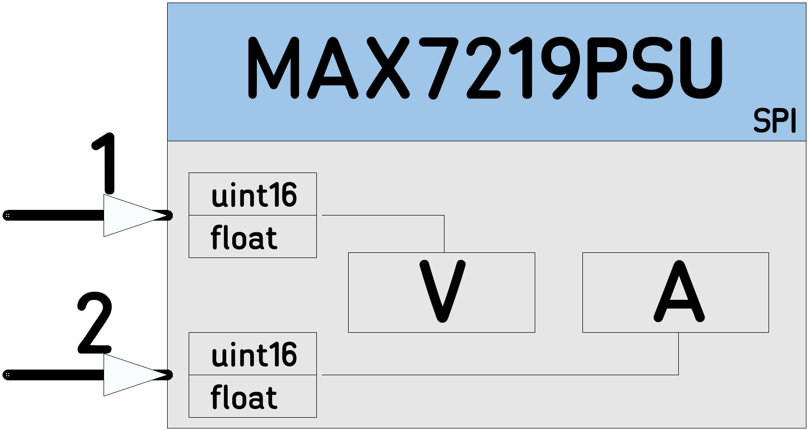

# [MAX7219PSU](https://github.com/nBlocksStudioNodes/nblocks_max7219psu)

Node to drive MAX7219 8 digits 7segment Led Display driver, in BCD mode for Volts (left 4 digits) and Amperes (right 4 digits) in a bench-PSU

----

----

 *  Category: Display
 *  HAL: mbed
 *  Tested: LPC1768
 *  Author: N. Chalikias

## Implementation details
Decimal point in the centre for both, 4-digit display-sets.  
If the input value is `float` then is displayed with 2 integer and 2 decimal digits,  
For example: “24.67”

## Inputs:
 *  (1) uint16 or float: value for Volts
 *  (2) uint16 or float: value for Amperes

## Parameters
 *  PinName: MOSI
 *  PinName: MISO
 *  PinName: SCK
 *  PinName: CS
 *  uint16_t: Brightness
 *  uint16_t: ScanLimit

## Example:

[Ticker]-->[Counter]-->[MAX7219PSU]

